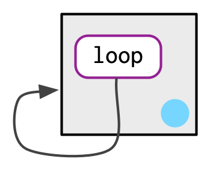
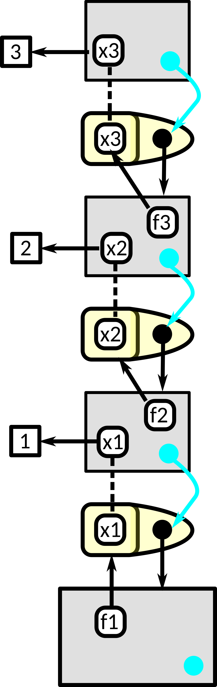

```{r setup, include=FALSE}
knitr::opts_chunk$set(echo       = TRUE, 
                      fig.align  = "center",
                      fig.height = 3, fig.width = 4)
ggplot2::theme_set(ggplot2::theme_bw() + ggplot2::theme(strip.background = ggplot2::element_rect(fill = "white")))
```

```{r klippy, echo=FALSE, include=TRUE}
klippy::klippy()
```

# Learning Objectives

- R Environments
- Chapter 7 from [Advanced R](https://adv-r.hadley.nz/)
    - These lecture notes are mostly taken straight out of Hadley's book. Many thanks for making my life easier.
    - His images, which I use here, are licensed under <a rel="license" href="http://creativecommons.org/licenses/by-nc-sa/4.0/"></a>

# Environment Basics

- Hadley and colleagues made a really great package that, among other things, allows for handling environments: `{rlang}`. It's way better than the base R functionality.

    ```{r}
    library(rlang)
    ```

- An **environment** is a fundamental data object in R that determines lexical scoping --- i.e. they determine when a name is bound to an object.

- Motivations:
    - Environments are used to make functions self-contained.
    - Environments are used to separate functions of the same name in different packages.
    - Environments are used in some object oriented programming systems in R.

- An environment is like a list, except:
    - Every name must be unique.
        - Lists can have multiple elements of the same name.
    - Names are not ordered.
        - Lists are ordered.
    - All environments (except the empty environment) have "parent" environments that they live in.
    - Environments use modify-in-place semantics.
        - Lists are copy-on-modify.
    
- Create a new environment with `rlang::env()`, which behaves a lot list `list()`.

    ```{r}
    e1 <- rlang::env(a = FALSE,
                     b = "a",
                     c = 2.3,
                     d = 1:3)
    ```

- Environments associate names to values without any particular order. Hadley draws them like this:

    
    
    - Above, the arrows indicate "bindings". So `b` is bound to `"a"` and `a` is bound to `FALSE`, etc...
    
    - The blue dot indicates the parent environment.
    
- Environments have "reference semantics", which means that they modify-in-place.

    ```{r}
    e2 <- e1
    e2$d <- 4:6
    e1$d
    ```

- An environment can contain itself.
    ```{r}
    e1$d <- e1
    ```

    

- Printing an environment just shows its address in memory.
    ```{r}
    e1
    ```

- To print the objects of an environment, use `rlang::env_print()`.

    ```{r}
    rlang::env_print(e1)
    ```

- Use `rlang::env_names()` to get a character vector with names.

    ```{r}
    rlang::env_names(e1)
    ```

- The current environment is the environment in which the code is currently being executed (where R looks for names). Use `rlang::current_env()` to get the current environment.

    ```{r}
    ce <- rlang::current_env()
    typeof(ce)
    ```

- The global environment is the environment where you interactively use R. You can access it with `rlang::global_env()`

    ```{r}
    gl <- rlang::global_env()
    typeof(gl)
    env_print(gl)
    ```
    
- We can see that the current environment is the global environment with `identical()`

    ```{r}
    identical(gl, ce)
    ```

- You should not use `==`. This is since `==` is expecting to be used on a vector, and an environment is not a vector.

# Parents

- Every environment has a **parent**. If a name is not found in the current environment then it is searched for in the parent. This is how lexical scoping operates in R.

- `rlang::env()` actually creates a **child** environment. You can either supply the parent or it assumes the parent is the current environment.

    ```{r}
    e2a <- env(d = 4, e = 5)
    e2b <- env(e2a, a = 1, b = 2, c = 3)
    ```

    
    
- In the above diagram, the pale blue dot represents a pointer to the parent. The left box is the child and the right box is the parent.

- `rlang::env_parent()` gives you the parent.
    ```{r}
    env_parent(e2b)
    e2a
    env_parent(e2a)
    ```
    
- Every environment has as an ancestor the empty environment, which has no parent. You can access it with `rlang::empty_env()`
    ```{r}
    em <- empty_env()
    rlang::env_print(em)
    rlang::env_parents(em)
    ```
    
- We can make children of the empty environment with `rlang::env()` by including the empty environment as the first argument.
    ```{r}
    e2c <- env(empty_env(), d = 4, e = 5)
    e2d <- env(e2c, a = 1, b = 2, c = 3)
    ```

    

- Your global environment has the empty environment as the progentor.
    ```{r}
    rlang::env_parents(rlang::global_env())
    ```
    
- The ancestors of the global environment are all of the attached packages that ultimately terminate in the empty environment. So `env_parents()` will stop at the global environment by default.

    ```{r}
    et <- rlang::env(x = 1:3)
    rlang::env_parents(et)
    rlang::env_parents(et, last = rlang::empty_env())
    ```

# Working with Objects in an Environment

- Regular assignment `<-` creates a variable in the current environment.

- Super assignment `<<-` modifies an existing variable found in the parent environment. If no such variable exists, it creates one in the global environment.

    ```{r}
    x <- 0
    f <- function() {
      x <<- 1
    }
    f()
    x
    ```
    
- Most of the time, it is not a good idea to use super assignment. Global variables are vary dangerous. We'll talk about one good application of them in Chapter 10.

- Get and set values from an environment the same way as from a list.

    ```{r}
    e3 <- env(x = 1, y = 2)
    e3$x
    e3[["x"]]
    ```

- Because environments are unordered, integer subsetting does not work
    ```{r, error = TRUE}
    e3[[1]]
    ```

- Because environments are not vectors, you cannot use sing brackets `[]`, so you cannot get more than one element.
    ```{r, error = TRUE}
    e3["x"]
    e3[c("x", "y")]
    ```

- You get `NULL` if a variable is not in an environment, just like a list:
    ```{r}
    e3$z
    ```

- Test if an environment has a binding with `rlang::env_has()`
    ```{r}
    rlang::env_has(e3, "x")
    rlang::env_has(e3, "z")
    ```
    
    
- Unlike a list, you do not remove elements by assigning them to `NULL`, because the name refers to `NULL`.

    ```{r}
    e3$a <- 10
    e3$a <- NULL
    e3$a
    rlang::env_has(e3, "a")
    ```
    
- Use `rlang::env_unbind()` to remove an object.

    ```{r}
    rlang::env_unbind(e3, "a")
    rlang::env_has(e3, "a")
    ```

# Hadley's Advanced R Exercises

1. Create an environment as illustrated by this picture.

    

    ```{r, eval = FALSE, echo = FALSE}
    loop <- rlang::env()
    loop$loop <- loop
    identical(loop$loop, loop)
    ```

2. Create a pair of environments as illustrated by this picture.

    
    
    ```{r, eval = FALSE, echo =  FALSE}
    loop <- rlang::env()
    dedoop <- rlang::env()
    dedoop$loop <- loop
    loop$dedoop <- dedoop
    identical(dedoop, loop$dedoop)
    identical(loop, dedoop$loop)
    ```
    
# Loop through environments

- Sometimes, you want to look through all of the ancestor environments to find an object, or for exploration. Here is an example where we count how many objects are in each ancestral environment.

    ```{r}
    count_env <- function(base_env = rlang::caller_env(), 
                          end_env = rlang::empty_env()) {
      nenv <- length(rlang::env_parents(env = base_env, last = end_env))
      obj_num <- rep(NA_real_, length.out = nenv)
      env <- base_env
      for(i in seq_len(nenv)) {
        obj_num[[i]] <- length(env)
        names(obj_num)[[i]] <- rlang::env_name(env)
        env <- rlang::env_parent(env)
      }
      return(obj_num)
    }
    count_env()
    ```

- The caller environment is the environment of the function that called the current function. See below.
    
# Special Environments

- Most environments are created by R, not by you.

- The most important ones are:

    - **Global Environment**: Environment that you, the user, interact with during an interactive session.
    
    - **Package Environment**: External interface for a package. When you, the user, uses a function, it looks for it in the package environment.
    
    - **Namespace Environment**: Internal interface for apackage. When the package searches for a function within the same package, it looks for it in the namespace environment.
    
    - **Imports Environment**: Functions used by the package. When the package searches for a function from another package, it looks for it in the imports environment.
    
    - **Function Environment** (aka enclosing environment): Environment where function was created and where it has access to objects. For a function from a package, this is the namespace environment. For a function you create during an interactive session, this is the global environment.
    
    - **Binding Environment** of a function: Environment where the name of a function is bound to the function. May or may not be the same as the function environment.
    
    - **Execution Environment**: Each time a function is called, a new temporary environment is created to host execution. This is to that function calls always have a "fresh start"
    
    - **Caller environment**: The environment in which the function was called.

## Package environments.

- Each package attached by `library()` creates a package environment that becomes an ancestor of the global environment. They are parents in the order that you attached them.

    

- This order is called the **search path** because variable names are searched in that order. You can see the search path with `rlang::search_envs()`.

    ```{r}
    rlang::search_envs()
    ```
    
- So if I try to evaluate a variable/function name, then it will first search for it in the global environment, then in the `{rlang}` package environment, then in the `{stats}` package environment, etc...

- Attaching a new package with `library()` makes that package the immediate parent of the global environment.
    ```{r, eval = FALSE}
    library(d)
    ```
    
    

## Function Environment

- The **function environment** is the environment where the function has access to all objects in that environment and its parent environments. This is the current environment when the function is created, **not** when the function is called.

- You can see the function environment via `rlang::fn_env()`

- The function environment may or may not be a new environment. E.g. most of the functions you write use the global environment as the function environment.    
    ```{r}
    x <- 5
    fn <- function() {
      sum(1:x)
    }
    rlang::fn_env(fn)
    ```
    
- Above, since the function environment is the global environment, `fn()` has access to `x` (which is in the global environment) and to `sum()` (which is in the namespace:base environment).

- Most functions in a package have the namespace environment (see below) as the function environment.

    ```{r}
    rlang::fn_env(base::sum)
    rlang::fn_env(stats::lm)
    rlang::fn_env(rlang::fn_env)
    ```

- The function environment may or may not be different from the environment where the name is bound to the function. That space is called the **binding environment** of the function.

- In many cases, the function environment is the same as the binding environment. Below, the name `f` in the global environment is bound to the function (arrow moving from f to the yellow object), so the binding environment is the global environment. Also below, the function is bound to the global environment (arrow moving from the black dot to the global environment), so the global environment has the objects that the function has access to, so the function environment is also the global environment.

    
    ```{r}
    y <- 1
    f <- function(x) {
      return(x)
    }
    ```


    

- Below, the name `g` in the `e` environment was created in the global environment. So the function environment is the global environment. But the name `g` is in the `e` environment, so the binding environment is `e`.

    ```{r}
    y <- 1
    e <- rlang::env()
    e$g <- function(x) {
      return(x)
    }
    ```

    

- **Exercise**: Does `g()` still have access to all of the objects in the global environment?

    ```{block, eval = FALSE, echo = FALSE}
    Yes. The global environment is the function environment of `g()`.
    ```
    ```{r, eval = FALSE, echo = FALSE}
    x <- 5 ## in global
    e$g <- function() x + 1 ## binding environment is `e`, but function environment is `g()`.
    e$g()
    ```


## Namespaces

- The **package environment** is the external interface for a package. It contains the exported functions of a package.

- The **namespace environment** of a package is the internal interface for a package. Functions in the package will search for its objects in the namespace environment.

- This is what allows us to modify (rather foolishly) `var()` but still allow `sd()` to work properly.

    ```{r}
    sd
    ```
    
    ```{r}
    x <- rnorm(10)
    sd(x)
    var <- function(x) 0
    var(x)
    sd(x)
    ```

- The namespace environment acts as the function environment for all functions in a package.

- An exported function has a binding both in the namespace environment and the package environment.

    

- An internal function only has a binding the namespace environment.

- The parent of a namespace environment is an **imports** environment that contains bindings of all functions used by the package.

- The parent of the imports environment is the base namespace, where all base functions are located (this is why you don't need to import `sum()` or use `base::sum()` in your package code).

- The parent of the base namespace is the global environment.

    ```{r}
    library(rlang)
    env_parents(fn_env(stats::var))
    env_parents(fn_env(rlang::fn_env))
    ```

    
    
- Below, let the yellow object be the `sd()` function defined in the package `{stats}`. Then whenever another function in `{stats}` uses `sd()` or `var()` it finds them in the `namespace:stats` environment. Right now, the `package:stats` environment also points to that function, so when the user uses `sd()` they can use the version created by the `{stats}` authors. However, if we change the definition of `var()`, we only change the binding in the `package:stats` environment, not in the `namespace:stats` environment. This means that `{stats}` functions will work even if we change the binding. In particular, `sd()`, which uses `var()`, will still work.

    

## Execution Environments

- Each time a function is called, a new environment is created to host execution. This is called the **execution environment**.

- This is why `a` is not saved between calls:
    ```{r}
    fn <- function() {
      if (!env_has(current_env(), "a")) {
        a <- 1
      } else {
        a <- a + 1
      }
      return(a)
    }
    fn()
    fn()
    ```

- The execution environment is always the child of the function environment.

- Consider this function

    ```{r}
    h <- function(x) {
      # 1.
      a <- 2 # 2.
      x + a
    }
    y <- h(1) # 3.
    ```

- The yellow object is the `h()` function. The name `h` is in the global environment (bottom right). The execution environment is the top left. `x` binds to 1. Then `a` is defined, it binds to `2`. When the function completes, it returns `3` and so `y` binds to `3` in the global environment. The execution environment is garbage collected.

    

- It is possible to explicitly return the execution environment so that it is not garbage collected. But this is rarely done.

    ```{r}
    h2 <- function(x) {
      a <- x * 2
      rlang::current_env()
    }
    e <- h2(x = 10)
    rlang::env_print(e)
    ```
    
- More frequently, the execution environment is maintained because it is a function environment of a returned function.

    ```{r}
    plus <- function(x) {
      function(y) x + y
    }
    
    plus_one <- plus(1)
    plus_one
    ```
    
    

- Above figure: the global environment is the bottom box. The execution environment is the top box. The `plus()` function is the right yellow object. Its function environment and binding environment is the global environment. When `plus()` is called with `x = 1`, it creates the execution environment where `x` is bound to `1`. When `plus_one()` is defined, its function environment is the execution environment (since that is where it was created), but its binding environment is the global environment (where the name is bound). Note that the parent environment of the `plus()`'s execution environment is the global environment.

    ```{r}
    rlang::fn_env(plus_one)
    rlang::env_parent(rlang::fn_env(plus_one))
    ```

- When we call `plus_one()`, its execution environment will have the execution environment of `plus()` as its parent.

    ```{r}
    x <- 20
    plus_one(2)
    ```

    

- When we call `plus_one()` with `y` bound to 2 (execution environment top left), when it tries to find `x` it first searches in 
    ```{r}
    rlang::fn_env(plus_one)
    ```
    (execution environment top right) before going to the global environment (bottom).

- **Exercise** (Advanced R): Draw a diagram that shows the function environments of this function, along with all bindings for the given execution.

    ```{r}
    f1 <- function(x1) {
      f2 <- function(x2) {
        f3 <- function(x3) {
          x1 + x2 + x3
        }
        f3(3)
      }
      f2(2)
    }
    f1(1)
    ```

    ```{block, eval = FALSE, echo = FALSE}
    
    
    `f1()`'s function and binding environments are the global environment.
    
    `f2()`'s function and binding environments are the execution environment of `f1()`. This is also where `x1` is bound to `1`.
    
    `f3()`'s function and binding environments are the execution environment of `f2()`. This is also where `x2` is bound to `2`.
    
    `f3()`'s execution environment is where `x3` is bound to `3`.
    ```
    
## Caller Environment

- Recall, the **function environment** is the environment in which the function was created.

- The **caller environment** is the environment in which the function was called (aka "used")

- You can get this environment inside a function via `rlang::caller_env()`.

    ```{r}
    fn1 <- function(x) {
      fn2 <- function(y) {
        rlang::caller_env()
      }
      e0 <- rlang::current_env() ## The execution environment of fn1()
      e1 <- fn2() ## The caller environment of fn2()
      e2 <- rlang::caller_env() ## The caller environment of fn1()
      return(list(e0, e1, e2))
    }
    fn1()
    ```

    
# Applications

## Numeric Derivatives

- `stats::numericDeriv()` numerically evaluates the gradient of an expression at some value. It assumes that the evaluation occurs within some environment you provide.

- Let's calculate the gradient of $x^y$ evaluated at $x = 3$.
    ```{r}
    myenv <- rlang::env(x = 3, y = 2)
    numericDeriv(expr = rlang::expr(x ^ y), theta = "x", rho = myenv)
    ```

- From calculus, we know that the derivative of $x^2$ is $2x$, and so the gradient evaluated at $x = 3$ should be $2\times 3 = 6$.

- `rlang::expr()` is discussed in Chapter 19. Basically, it captures an expression without evaluating it. This is called "quoting". We can then evaluate that expression with `eval()`. 
    ```{r}
    rlang::expr(x^2) 
    rlang::expr(x^2) |> eval(envir = myenv)
    rlang::expr(sum(c(1, 2, 3)))
    rlang::expr(sum(c(1, 2, 3))) |> eval(envir = rlang::global_env())
    ```

## Managing State

- An R package cannot alter the global environment. 

- Objects in packages are locked, so cannot be changed.

- Say you want to keep track of whether or not a function was run (e.g. to write a message on first use). I have done this to (i) say that a function is defunct or (ii) list out special licenses that cover a method.

- One way you could keep track of this is to use super assign in a function that will change the value of a logical in the package environment.

    ```{r}
    ran_fun <- FALSE ## Global variable
    fun <- function() {
      if (!ran_fun) {
        message("Here is a message")
        ran_fun <<- FALSE ## this alters package environment
      }
    }
    fun()
    fun()
    ```

- What I think is better is having an environment specific to messages, that way you have to worry less about global variables.

    ```{r}
    menv <- rlang::env(ran_fun = FALSE)
    fun <- function() {
      if (!menv$ran_fun) {
        message("Here is a message")
        menv$ran_fun <- TRUE
      }
    }
    fun()
    fun()
    ```
    
- This functionality is very popular, so `{rlang}` has a function dedicated to it.

    ```{r}
    fun <- function() {
      rlang::warn("Here is a message", .frequency = "once", .frequency_id = "ran_fun")
    }
    fun()
    fun()
    ```
    
- **Exercise**: Use environments to keep a tally for how many times a function called `foo()` is run. Create another function called `foo_count()` that returns that number. E.g.

    ```{r, eval = TRUE, echo = FALSE}
    fooenv <- rlang::env(numtimes = 0)
    foo <- function() {
      fooenv$numtimes <- fooenv$numtimes + 1
    }
    
    foo_count <- function() {
      return(fooenv$numtimes)
    }
    ```

    ```{r}
    foo_count()
    foo()
    foo()
    foo()
    foo_count()
    ```
    
# R6 Objects

- We will not cover R6 objects, but they use environments to do modify-by-reference instead of copy-on-modify semantics. This makes them fast.

# Hashing

- Hashing is a quick way to select an object from a bunch of possible objects. You use a hash key to select a hash value.

- Hashing in R was done through the `{hash}` package using environments.

- Hashing is way quicker than using a list or a vector.

- In the below example, using hashing is about 1000 times faster than using native R vectors.

    ```{r, message = FALSE}
    library(hash)
    words <- read.table("https://data-science-master.github.io/lectures/data/words.txt",
                        header = TRUE, 
                        na.strings = "")
    h <- hash(keys = words$word, values = seq_along(words$word))
    l <- seq_along(words$word)
    names(l) <- words$word
    
    bench::mark(
      h$MOTIVITIES,
      l[["MOTIVITIES"]],
    ) |>
      dplyr::select(expression:result) |>
      knitr::kable()
    ```
    
- Though, for this lookup to be worthwhile, you would need to be doing lookups millions of times a second.

# New Functions

- `rlang::env()`: Create a new child environment.
- `rlang::env_print()`: Print an environment's bindings.
- `rlang::env_names()`: Print names in an environment.
- `rlang::env_parent()`: Print the parent of an environment.
- `rlang::env_has()`: Test if an environment has a binding.
- `rlang::current_env()`: Access current environment.
- `rlang::env_bind()`: Add objects to an environment.
- `rlang::env_unbind()`: Remove objects from an environment.
- `rlang::global_env()`: Access global environment.
- `rlang::empty_env()`: Access the empty environment.
- `rlang::fn_env()`: Access the function environment.
- `rlang::caller_env()`: Access the caller environment.
- `rlang::search_envs()`: Show the search path.
- `identical()`: Check if two objects are exactly equal.
