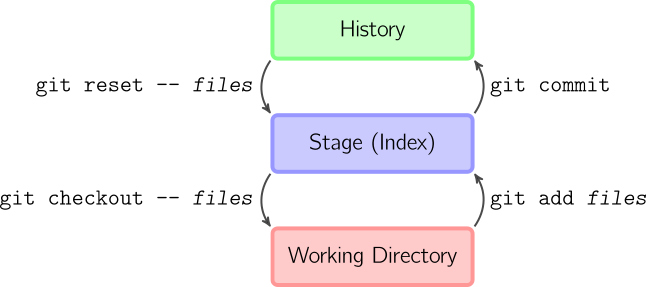

```{r setup, include=FALSE}
knitr::opts_chunk$set(echo       = TRUE, 
                      fig.align  = "center",
                      fig.height = 3, fig.width = 4)
ggplot2::theme_set(ggplot2::theme_bw() + ggplot2::theme(strip.background = ggplot2::element_rect(fill = "white")))
```

```{r klippy, echo=FALSE, include=TRUE}
klippy::klippy()
```

# Learning Objectives

- Version Control with git.
- Collaboration and software-hosting with GitHub.
- [Git Cheat Sheet](https://education.github.com/git-cheat-sheet-education.pdf)
- [Git Handbook](https://guides.github.com/introduction/git-handbook/)
- [Git Novice](https://swcarpentry.github.io/git-novice/)
- [Connecting to GitHub with SSH](https://docs.github.com/en/authentication/connecting-to-github-with-ssh)

# Installing Git

1. Install git:
    - Windows: <http://git-scm.com/download/win>.
    - OS X: <http://git-scm.com/download/mac>.
    - Debian/Ubuntu: `sudo apt-get install git-core`.
    - Other Linux distros: <http://git-scm.com/download/linux>.

2. Create an account on GitHub: <https://github.com/>
    - A free plan is fine. Use the same email address you used above.
    - When you choose your username, remember that you might use this for
      professional purposes. So I would recommend something related to your name 
      (e.g. my handle is "dcgerard"). I would recommend against something like 
      "david_awesome_david_yolo_hahaha".
      
3. Tell git your name and email address. Open up a terminal and type:

    ```{bash, eval = FALSE}
    git config --global user.name "YOUR FULL NAME"
    git config --global user.email "YOUR EMAIL ADDRESS"
    ```
    
    If you are worried about email privacy, then use "\<username\>@users.noreply.github.com" as your email address, then follow the instructions [here](https://help.github.com/en/articles/setting-your-commit-email-address-on-github) to make your email address private on GitHub.
    
4. Choose your favorite editor to be your default
    - Nano (a simple text editor): 
        ```{bash, eval = FALSE}
        git config --global core.editor "nano -w"
        ```
    - Notepad (Windows only): 
        ```{bash, eval = FALSE}
        git config --global core.editor "c:/Windows/System32/notepad.exe"
        ```
    - Emacs (for the brave) if it is already installed:
        ```{bash, eval = FALSE}
        git config --global core.editor "emacs"
        ```

# Authentication

- To integrate GitHub (the website) with git (the command-line program), you have to set up the proper authorization.

- If you can already integrate with GitHub, then skip this step.

- GitHub now requires you to use either [Personal Access Tokens](https://docs.github.com/en/authentication/keeping-your-account-and-data-secure/creating-a-personal-access-token) or [SSH Keys](https://docs.github.com/en/authentication/connecting-to-github-with-ssh) for interfacing. For this class, we'll use SSH Keys since its implementation is slightly easier.

- SSH uses what's called a [key pair](https://en.wikipedia.org/wiki/Public-key_cryptography) where GitHub houses a "public key" (a very long publicly known password) and you have on your computer a "private key" (a very long privately known password). 

- Think about the public key as a padlock, and the private key as the key. You have to use to private key to unlock the public key.

- You need to generate a new private key, and go through the below steps, for each computer for which you intend to use git.

## Check for existing SSH Keys

- In the terminal run
    ```{bash, eval = FALSE}
    ls -al ~/.ssh
    ```
    
- This will say something like "ls: cannot access '/c/Users/Vlad Dracula/.ssh': No such file or directory" if you don't have any public/private key pairs.
    
- This will list out files names like "id_rsa.pub", "id_ecdsa.pub", or "id_ed25519.pub" if you do have a public/private key pair.
    
## Generate a new SSH key

- If you **do** have an SSH key, go to the next section ("Add an SSH key to the ssh-agent")

- If you **don't** have an SSH key, follow the below steps. 

- In the terminal, run 
    ```{bash, eval = FALSE}
    ssh-keygen -t ed25519 -C "your_email@example.com"
    ```
    
- Press enter if prompted where to save the key to accept the default location.

- At the prompt, type a password that you can remember.

## Add an SSH key to the ssh-agent

1. In the terminal, run the following to start the ssh-agent in the background.
    ```{bash, eval = FALSE}
    eval "$(ssh-agent -s)"
    ```
    
2. In the terminal, run the following to add your SSH private key to the ssh-agent:
    ```{bash, eval = FALSE}
    ssh-add ~/.ssh/id_ed25519
    ```

## Add public key to GitHub

1. Run the following in the terminal to show the contents of "id_ed25519.pub".
    ```{bash, eval = FALSE}
    cat ~/.ssh/id_ed25519.pub
    ```

2. Highlight the output using your mouse and copy the contents.


3. On [GitHub](https://github.com/), in the upper right corner, click on your profile photo and click on "Settings"

    
    
4. On the left sidebar, click on "SSH and GPG keys"
    
    
    
5. Click on "New SSH key"

    
    
6. In the title field, choose a descriptive title, like "Personal Laptop".

7. Paste your key into the "Key" field.

8. Click "Add SSH key" and confirm your GitHub password.

## Test to see if it worked

1. Enter the following in the terminal:

    ```{bash, eval = FALSE}
    ssh -T git@github.com
    ```

2. Type "yes" if prompted to continue connecting.

3. You are successful if you see something like
    ```
    Hi dcgerard! You've successfully authenticated, but GitHub does not provide shell access.
    ```

# Version Control: 

- **Version control system**: a program that tracks iterative changes of files. 
  Git is the most popular version control system.

- You can go back to previous versions of your code/text, then move forward to 
  the most recent version, or keep the old version.

- You can create copies of the code, change them, then merge these copies 
  together later.

## Motivation 1: Change code without the fear of breaking it
- You want to try out something new, but you aren't sure if it will work.

- Non-git solution: Copy the files
    - analysis.R, 
    - analysis2.R, 
    - analaysis3.R, 
    - analysis_final.R, 
    - analysis_final_final.R, 
    - analysis_absolute_final.R, 
    - analysis7.R
    - analysis8.R

- Issues: 
    - Difficult to remember differences of files.
    - Which files produced specific results?
    
- Git lets you change files, keeping track of old versions, and reverting 
  to old versions if you decide the new changes don't work.

## Motivation 2: Easy Collaboration

- In a group setting, your collaborators might suggest how to change your 
  analysis/code.
  
- First non-git solution: Email files back/forth. 

- Issues: 
    - You have to manually incorporate changes.
    - Only one person can work on the code at a time (otherwise multiple 
      changes might be incompatible).
      
- Second non-git solution: Share a Dropbox or Google Docs folder (a 
  "centralized" version control system).

- Issues:
    - Again, only one person can work on the code at a time.
    - Less user-friendly for tracking changes.

- Git let's each individual work on their own local repository and you can
  automatically incorporate changes. 

## Motivation 3: Great for job interviews

- In a [Kaggle Survey](https://www.kaggle.com/surveys/2017), 58.5% of data
  scientists say they primarily use git for sharing code.
  
- You can make your final-project repo public so prospective employers can
  view your work.
  
- You can host a website on GitHub, increasing your visibility. I host my 
  [personal website](http://dcgerard.github.io/) and 
  [teaching websites](https://data-science-master.github.io/lectures/) 
  on GitHub.
  
# Basic Git

- A **repository** (or repo, for short) is a collection of files (in a folder and its subfolders) that are together under version control. In data analysis, each repository is typically one project (like a data analysis, a homework, or a collection of code that performs a similar task).

- The way git works (graphic from Mark Lodato):

    \ 

- **Working Directory**: To git, this means the current versions of the files. Changes to files that you haven't recorded only exist in the working directory and are not yet saved in the history.
- **Stage**: Files that are scheduled to be committed to the history, but not yet committed. Only files in the stage will be committed to the history.
- **History**: The timeline of snapshots of files. You commit a file to the history and then, even if you modify it later, you can always go back to that same file version.

- We'll focus on the right-hand-side of this diagram where your workflow is typically:
    1. Modify files in your working directory until you want a snapshot.
    2. Add these modified files to the staging area.
    3. Commit staged files to history, where they will be kept forever.

- The left-hand side of the diagram is used when you want to undo mistakes.  

- All git commands begin with `git` followed immediately by an argument for
  the type of command you want to execute.

- For the right-hand-side of the diagram, the following are the useful 
  git commands:
    - `git init`: Initialize a git repository. *Only do this once per project*.
    - `git status`: Show which files are staged in your working directory, and which
      are modified but not staged.
    - `git add`: Add modified files from your working directory to the stage.
    - `git diff`: Look at how files in the working directory have been
      modified.
    - `git diff --staged`: Look at how files in the stage have been modified.
    - `git commit -m "[descriptive message]"`: commit your staged content as a new 
      commit snapshot.
  
## Initialize a repository

- Git needs to be told that a folder is a repo. Otherwise, it won't keep files under version control.

- In this class, you won't need to tell git this (I'll tell git this), but in the real world you will. So we'll go over how to do this on GitHub and on the terminal.

### On GitHub

- Git is a version control system, GitHub is a website that hosts git repositories.

- You can create a git repo on GitHub (GitHub's server is called the "remote"), then download ("clone") the repo onto your computer (your computer called the "local").

### On the terminal

## Status

## Staging

## Committing

## Looking at differences

## Cloning

## Pushing

## Pulling

## Branching

## Merge Conflicts

# List of git commands

- `git init`: Initialize a git repository. *Only do this once per project*.
- `git status`: Show which files are staged in your working directory, and which are modified but not staged.
- `git add`: Add modified files from your working directory to the stage.
- `git diff`: Look at how files in the working directory have been modified.
- `git diff --staged`: Look at how files in the stage have been modified.
- `git commit -m "[descriptive message]"`: commit your staged content as a new commit snapshot.
- `git clone <url>`: Download a fresh copy of a remote repository onto your local machine.
- `git remote add <remote> <url>`: Link a local repository with a remote repository. The nickname of the remote repository is `<remote>`.
- `git push <remote> <branch>`: Push the changes from branch `<branch>` to the remote repository named `<remote>`
- `git pull <remote> <branch>`: Pull any modifications from `<remote>` into your local machine in branch `<branch>`.
- `git branch <branch>`: Create a branch called `<branch>`. Note that the default branch is called `master`.
- `git checkout <branch>`: Move to the `<branch>` branch.
- `git merge <branch>`: Merge the changes in `<branch>` into the current branch.

# Vocabulary List ([Blischak et. al., 2016](https://doi.org/10.1371/journal.pcbi.1004668))

- **Version Control System** (VCS): (*noun*) a program that tracks changes to specified files over time and maintains a library of all past versions of those files
- **Git**: (*noun*) a version control system
- **repository** (**repo**): (*noun*) folder containing all tracked files as well as the version control history
- **commit**: (*noun*) a snapshot of changes made to the staged file(s); (*verb*) to save a snapshot of changes made to the staged file(s)
- **stage**: (*noun*) the staging area holds the files to be included in the next commit; (*verb*) to mark a file to be included in the next commit
- **track**: (*noun*) a tracked file is one that is recognized by the Git repository
- **branch**: (*noun*) a parallel version of the files in a repository
- **local**: (*noun*) the version of your repository that is stored on your personal computer
- **remote**: (*noun*) the version of your repository that is stored on a remote server; for instance, on GitHub
- **clone**: (*verb*) to create a local copy of a remote repository on your personal computer
- **fork**: (*noun*) a copy of another user’s repository on GitHub; (*verb*) to copy a repository; for instance, from one user’s GitHub account to your own
- **merge**: (*verb*) to update files by incorporating the changes introduced in new commits
- **pull**: (*verb*) to retrieve commits from a remote repository and merge them into a local repository
- **push**: (*verb*) to send commits from a local repository to a remote repository
- **pull request**: (*noun*) a message sent by one GitHub user to merge the commits in their remote repository into another user’s remote repository


