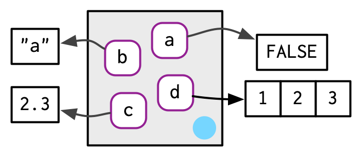

```{r setup, include=FALSE}
knitr::opts_chunk$set(echo       = TRUE, 
                      fig.align  = "center",
                      fig.height = 3, fig.width = 4)
ggplot2::theme_set(ggplot2::theme_bw() + ggplot2::theme(strip.background = ggplot2::element_rect(fill = "white")))
```

```{r klippy, echo=FALSE, include=TRUE}
klippy::klippy()
```

# Learning Objectives

- R Environments
- Chapter 7 from [Advanced R](https://adv-r.hadley.nz/)
    - These lecture notes are mostly taken straight out of Hadley's book. Many thanks for making my life easier.
    - His images, which I use here, are licensed under <a rel="license" href="http://creativecommons.org/licenses/by-nc-sa/4.0/"></a>

# Environment Basics

- Hadley and colleagues made a really great package that, among other things, allows for handling environments: `{rlang}`. It's way better than the base R functionality.

    ```{r}
    library(rlang)
    ```

- An **environment** is a fundamental data object in R that determines lexical scoping --- i.e. they determine when a name is bound to an object.

- Motivations:
    - Environments are used to make functions self-contained.
    - Environments are used to separate functions of the same name in different packages.
    - Environments are used in some object oriented programming aspects of R.

- An environment is like a list, except:
    - Everyname must be unique (lists can have multiple elements of the same name).
    - Names are not ordered (lists are ordered)
    - All environments (except the empty environment) have "parent" environments that they live in, and
    - Environments use modify-in-place semantics (not copy-on-modify).
    
- Create a new environment with `rlang::env()`, which behaves a lot list `list()`.

    ```{r}
    e1 <- rlang::env(a = FALSE,
                     b = "a",
                     c = 2.3,
                     d = 1:3)
    ```

- Environments associate names to values without any particular order. Hadley draws them like this:

    
    
- Environments have "reference semantics", which means that they modify-in-place.

    ```{r}
    e2 <- e1
    e2$d <- 4:6
    e1$d
    ```

- One by-product is that an environemnt can contain itself.
    ```{r}
    e1$d <- e1
    ```

    

- Printing an environment just shows its address
    ```{r}
    e1
    ```

- To print the objects of an environment, use `rlang::env_print()`.

    ```{r}
    rlang::env_print(e1)
    ```

- Use `rlang::env_names()` to get a character vector with names.

    ```{r}
    rlang::env_names(e1)
    ```

- The current environment is the environment in which the code is currently being executed (where R looks for names). Use `rlang::current_env()` to get the current environment.

    ```{r}
    ce <- rlang::current_env()
    typeof(ce)
    ```

- The global environment is the environment where you interactively use R. You can access it with `rlang::global_env()`

    ```{r}
    gl <- rlang::global_env()
    typeof(gl)
    env_print(gl)
    ```
    
- We can see that the current environment is the global environment with `identical()`

    ```{r}
    identical(gl, ce)
    ```

- You should not use `==`. This is since `==` is expecting to be used on a vector, and an environment is not a vector.

# Parents

- Every environment has a **parent**. If a name is not found in the current environment then it is searched for in the parent. This is how lexical scoping operates in R.

- `rlang::env()` actually creates a **child** environment. You can either supply the parent or it assumes the parent is the current environment.

    ```{r}
    e2a <- env(d = 4, e = 5)
    e2b <- env(e2a, a = 1, b = 2, c = 3)
    ```

    
    
- In the above diagram, the pale blue dot represents a pointer to the parent. The left box is the child and the right box is the parent.

- `rlang::env_parent()` gives you the parent.
    ```{r}
    env_parent(e2b)
    e2a
    env_parent(e2a)
    ```
    
- Every environment has as an ancestor the empty environment, which has no parent. You can access it with `rlang::empty_env()`
    ```{r}
    em <- empty_env()
    rlang::env_print(em)
    rlang::env_parents(em)
    ```
    
- We can make children of the empty environment with
    ```{r}
    e2c <- env(empty_env(), d = 4, e = 5)
    e2d <- env(e2c, a = 1, b = 2, c = 3)
    ```

    

- Your global environment has the empty environment as the progentor.
    ```{r}
    rlang::env_parents(rlang::global_env())
    ```
    
- The ancestors of the global environment are all of the attached packages that ultimately terminate in the empty environment. So `env_parents()` will stop at the global environment by default.

```{r}
et <- rlang::env(x = 1:3)
rlang::env_parents(et)
rlang::env_parents(et, last = rlang::empty_env())
```

# Super Assignmennt `<<-`

- Regular assignment `<-` creates a variable in the current environment.

- Super assignment `<<-` modifies an existing variable found in the parent environment. If no such variable exists, it creates one in the global environment.

    ```{r}
    x <- 0
    f <- function() {
      x <<- 1
    }
    f()
    x
    ```
    
- Most of the time, it is not a good idea to use super assignment. Global variables are vary dangerous. We'll talk about one good application of them in Chapter 10.

- Get and set values from an environment the same way as from a list.

    ```{r}
    e3 <- env(x = 1, y = 2)
    e3$x
    e3[["x"]]
    ```

- Because environments are unordered, integer subsetting does not work
    ```{r, error = TRUE}
    e3[[1]]
    ```

- Because environments are not vectors, you cannot use sing brackets `[]`, so you cannot get more than one element.
    ```{r, error = TRUE}
    e3["x"]
    e3[c("x", "y")]
    ```

- You get `NULL` if a variable is not in an environment, just like a list:
    ```{r}
    e3$z
    ```

- Test if an environment has a binding with `rlang::env_has()`
    ```{r}
    rlang::env_has(e3, "x")
    rlang::env_has(e3, "z")
    ```
    
    
- Unlike a list, you do not remove elements by assigning them to `NULL`, because the name refers to `NULL`.

    ```{r}
    e3$a <- 10
    e3$a <- NULL
    e3$a
    rlang::env_has(e3, "a")
    ```
    
- Use `rlang::env_unbind()` to remove an object.

    ```{r}
    rlang::env_unbind(e3, "a")
    rlang::env_has(e3, "a")
    ```

# Hadley's Advanced R Exercises

1. Create an environment as illustrated by this picture.

    

    ```{r, eval = FALSE, echo = FALSE}
    loop <- rlang::env()
    loop$loop <- loop
    identical(loop$loop, loop)
    ```

2. Create a pair of environments as illustrated by this picture.

    
    
    ```{r, eval = FALSE, echo =  FALSE}
    loop <- rlang::env()
    dedoop <- rlang::env()
    dedoop$loop <- loop
    loop$dedoop <- dedoop
    identical(dedoop, loop$dedoop)
    identical(loop, dedoop$loop)
    ```
    
# Loop through environments

- Sometimes, you want to look through all of the ancestor environments to find an object, or for exploration. Here is an example where we count how many objects are in each ancestral environment.

    ```{r}
    count_env <- function(base_env = rlang::caller_env(), 
                          end_env = rlang::empty_env()) {
      nenv <- length(rlang::env_parents(env = base_env, last = end_env))
      obj_num <- rep(NA_real_, length.out = nenv)
      env <- base_env
      for(i in seq_len(nenv)) {
        obj_num[[i]] <- length(env)
        names(obj_num)[[i]] <- rlang::env_name(env)
        env <- rlang::env_parent(env)
      }
      return(obj_num)
    }
    count_env()
    ```

- The caller environment is the environment of the function that called the current function. See below.
    
# Special Environments

- Most environments are created by R, not by you. Let's talk about these.

## Package environments.

- Each package attached by `library()` creates an package environment that becomes an ancestor of the global environment. They are parents in the order that you attached them.

    

- This order is called the **search path** because variable names are searched in that order. You can see the search path with `rlang::search_envs()`.

    ```{r}
    rlang::search_envs()
    ```
    
- So if I try to evaluate a variable/function name, then it will first search for it in the global environment, then in the `{rlang}` package environment, then in the `{stats}` package environment, etc...

- Attaching a new package with `library()` makes that package the immediate parent of the global environment.
    ```{r, eval = FALSE}
    library(d)
    ```
    
    

## Function Environment

- The **function environment** is the environment where the function finds its variables. This is the current environment when the function is created.

- You can see the function environment via `rlang::fn_env()`

    ```{r}
    rlang::fn_env(base::sum)
    ```

- This may or may not be different from the environment where the name is bound to the function. This is called the **binding environment** of the function.

- In many cases, the function environment is the same as the binding environment. Below, the name `f` in the global environment is bound to the function (binding environment), and the function is bound to the global environment (function environment):

    

- Below, the name `g` in the `e` environment was created in the global environment. So the function envrionment is the global environment, but the name `g` is in the `e` environment.

    ```{r}
    e <- rlang::env()
    e$g <- function() 1
    ```

    

    
# Applications

## Numeric Derivatives

- `stats::numericDeriv()` numerically evaluates the gradient of an expression at some value. It assumes that the evaluation occurs within some environment you provide.

- Let's calculate the gradient of $x^y$ evaluated at $x = 3$.
    ```{r}
    myenv <- rlang::env(x = 3, y = 2)
    numericDeriv(expr = rlang::expr(x ^ y), theta = "x", rho = myenv)
    ```

- From calculus, we know that the derivative of $x^2$ is $2x$, and so the gradient evaluated at $x = 3$ should be $2\times 3 = 6$.

- `rlang::expr()` is discussed in Chapter 19. Basically, it captures an expression without evaluating it. This is called "quoting". We can then evaluate that expression with `eval()`. 
    ```{r}
    rlang::expr(x^2) 
    rlang::expr(x^2) |> eval(envir = myenv)
    rlang::expr(sum(c(1, 2, 3)))
    rlang::expr(sum(c(1, 2, 3))) |> eval(envir = rlang::global_env())
    ```

## Managing State

- An R package cannot alter the global environment. 

- Objects in packages are locked, so cannot be changed.

- Say you want to keep track of whether or not a function was run (e.g. to write a message on first use). I have done this to (i) say that a function is defunct or (ii) list out special licenses that cover a method.

- One way you could keep track of this is to use superassign in a function that will change the value of a logical in the package environment.

    ```{r}
    ran_fun <- FALSE ## Global variable
    fun <- function() {
      if (!ran_fun) {
        message("Here is a message")
        ran_fun <<- FALSE ## this alters package environment
      }
    }
    fun()
    fun()
    ```

- What I think is better is having an environment specific to messages, that way you have to worry less about global variables.

    ```{r}
    menv <- rlang::env(ran_fun = FALSE)
    fun <- function() {
      if (!menv$ran_fun) {
        message("Here is a message")
        menv$ran_fun <- TRUE
      }
    }
    fun()
    fun()
    ```
    
- This functionality is very popular, so `{rlang}` has a function dedicated to it.

    ```{r}
    fun <- function() {
      rlang::warn("Here is a message", .frequency = "once", .frequency_id = "ran_fun")
    }
    fun()
    fun()
    ```

# New Functions

- `rlang::env()`: Create a new child environment.
- `rlang::env_print()`: Print an environment's bindings.
- `rlang::env_names()`: Print names in an environment.
- `rlang::env_parent()`: Print the parent of an environment.
- `rlang::env_has()`: Test if an environment has a binding.
- `rlang::current_env()`: Access current environment.
- `rlang::env_bind()`: Add objects to an environment.
- `rlang::env_unbind()`: Remove objects from an environment.
- `rlang::global_env()`: Access global environment.
- `rlang::empty_env()`: Access the empty environment.
- `rlang::search_envs()`: Show the search path.
- `identical()`: Check if two objects are exactly equal.
