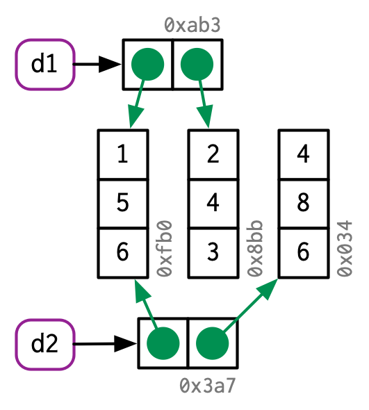
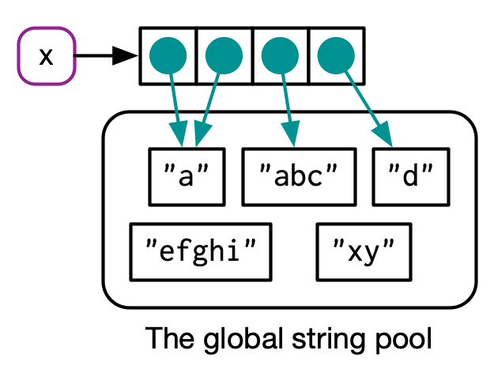

```{r setup, include=FALSE}
knitr::opts_chunk$set(echo       = TRUE, 
                      fig.align  = "center",
                      fig.height = 3, fig.width = 4)
ggplot2::theme_set(ggplot2::theme_bw() + ggplot2::theme(strip.background = ggplot2::element_rect(fill = "white")))
```

```{r klippy, echo=FALSE, include=TRUE}
klippy::klippy()
```

# Learning Objectives

- Names/Values
- Copy-on-modify
- Modify-by-reference
- Chapter 2 from [Advanced R](https://adv-r.hadley.nz/)
    - These lecture notes are mostly taken straight out of Hadley's book. Many thanks for making my life easier.
    - His images, which I use here, are licensed under <a rel="license" href="http://creativecommons.org/licenses/by-nc-sa/4.0/"></a>

# Names and Values

- [Computer Memory](https://en.wikipedia.org/wiki/Computer_memory) is information (like numbers or strings) that is for immediate use. When you put information there, it is located at some "address" on your computer, and you can retrieve it from that address.

- The following puts the vector `c(1,2,3)` in memory, and binds the name `x` to it

    ```{r}
    x <- c(1, 2, 3)
    ```

    

- The function `lobstr::obj_addr()` let's us see the address of this object.
    ```{r}
    lobstr::obj_addr(x)
    ```

- When you assign `x` to a new variable name `y`, it makes a new name that points to the same object as `x`.

    ```{r}
    y <- x
    ```

    
    
    ```{r}
    lobstr::obj_addr(y)
    ```
    
- If you modify `y`, then it will make a copy of object `r lobstr::obj_addr(x)` and point `y` to that new object. This is called **copy-on-modify**

    ```{r}
    y[[3]] <- 4
    ```

    
    
    ```{r}
    lobstr::obj_addr(y)
    ```

- Copy-on-modify exists so that `x` does not change when you change `y`.
    ```{r}
    x
    ```

- You can use `tracemem()` to track whenever an object is copied.

    ```{r}
    x <- c(1, 2, 3)
    tracemem(x)
    y <- x
    y[[3]] <- 4 ## copy made
    y[[5]] <- 1 ## no copy made, y modified
    ```
    
- **Note**: `tracemem()` is connected to the object (here `r lobstr::obj_addr(x)`), **not** the name `x`. So the following will not show a copy-on-modify because we changed the binding of the name `x`.

    ```{r}
    x <- c(1, 2, 3)
    tracemem(x)
    x <- c(4, 5)
    y <- x
    y[[2]] <- 6
    ```

- **Note**: `tracemem()` will give you weird results if you use it inside of RStudio. That's because the Environment pane makes references to objects.

- Name `a` inside function points to same object

    ```{r}
    x <- c(1, 2, 3)
    tracemem(x)
    f <- function(a) {
      return(a)
    }
    z <- f(x) ## no copy made
    ```

    
    
    and `x` and `z` now point to same object
    
    

- **Exercise**: When does the address of `x` change? Use `cat()` and `lobstr::obj_addr()` to verify your answer. Does `tracemem()` help you here? Why are why not?
    ```{r, eval = FALSE}
    x <- c()
    for (i in 1:10) {
      x[[i]] <- i
    }
    ```
    
    ```{r, eval = FALSE, echo = FALSE}
    ## 10 times
    x <- c()
    lobstr::obj_addr(x)
    for (i in 1:10) {
      x[[i]] <- i
      cat(lobstr::obj_addr(x), "\n")
    }
    ```
    
    ```{block, eval = FALSE, echo = FALSE}
    It appears that `tracemem()` only detects one copy-on-modify. I think `tracemem()` is connected to the object address, not the name, and that's why it does not show up in the for-loop.
    ```
    
    
- **Exercise**: When does the address of `x` change? Use `cat()` and `lobstr::obj_addr()` to verify your answer.
    ```{r, eval = FALSE}
    x <- rep(x = NA_real_, length.out = 10)
    for (i in 1:10) {
      x[[i]] <- i
    }
    ```

    ```{r, eval = FALSE, echo = FALSE}
    ## 0 times. 
    ## If you see a copy, that's because you are using R Studio
    x <- rep(x = NA_real_, length.out = 10)
    lobstr::obj_addr(x)
    for (i in 1:10) {
      x[[i]] <- i
      cat(lobstr::obj_addr(x), "\n")
    }
    ```
 
- **Exercise**: When does the address of `x` change? Use `cat()` and `lobstr::obj_addr()` to verify your answer.
    ```{r, eval = FALSE}
    x <- vector(mode = "numeric", length = 10)
    for (i in 1:10) {
      x[[i]] <- i
    }
    ```
    
    ```{r, eval = FALSE, echo = FALSE}
    ## 0 times. 
    ## If you see a copy, that's because you are using R Studio
    x <- vector(mode = "numeric", length = 10)
    lobstr::obj_addr(x)
    for (i in 1:10) {
      x[[i]] <- i
      cat(lobstr::obj_addr(x), "\n")
    }
    ```
 
- Understanding when an object is copied is important for performance. Making copies can be expensive if you are doing it a lot (like in a for-loop), making your code run much slower.
 
# Lists and Data Frames

- Recall that a list is a vector that can have elements of any type.

- To do this, list's name points to a vector of references, and these point to the objects.

    ```{r}
    l1 <- list(1, 2, 3)
    ```

    
    
- Copy on modify for a list only copies the references, so is much more memory efficient. This is called a **shallow copy**.

    ```{r}
    l2 <- l1
    ```

        
    
    ```{r}
    l2[[3]] <- 4
    ```
    
       
    
- `lobstr::ref()` allows you to see the location of each component of a list.
    ```{r}
    lobstr::ref(l1, l2)
    ```

    - Notice that the lists are at different addresses, the first two objects of each list are at the same address, but the third object of each list are at different addresses.

- Data frames are lists of vectors (the columns)

    ```{r}
    d1 <- data.frame(x = c(1, 5, 6), y = c(2, 4, 3))
    ```
    
    
    
- Modify a column, then only that column is copied and modified

    ```{r}
    d2 <- d1
    d2[, 2] <- d2[, 2] * 2
    ```

    
    
    ```{r}
    lobstr::ref(d1, d2)
    ```
    
- Modify a row, then the entire data frame is copied (much less efficient).

    ```{r}
    d3 <- d1
    d3[1, ] <- d3[1, ] * 3
    ```

    
    
    ```{r}
    lobstr::ref(d1, d3)
    ```

## Character Vectors

- A character vector is a vector of references to a global string pool.

    ```{r}
    x <- c("a", "a", "abc", "d")
    ```

    
    
- But Hadley usually writes this as

    
    
- Use `lobstr::ref()` to show these references.
    ```{r}
    lobstr::ref(x, character = TRUE)
    ```

- **Exercise**: Why is `x` copied here? (it is only copied twice if you use R studio)
    ```{r}
    x <- c(1L, 2L, 3L)
    tracemem(x)
    x[[3]] <- 4
    ```

# New Functions

- `tracemem()`: Tracks an object so that a message is printed whenever it is copied.
- `untracemem()`: Untracks an object.
- `lobstr::ref()`: Display a tree of object addresses.
- `lobstr::obj_addr()`: Gives the address (in memory) of an object that a name points to.
- `lobstr::obj_size()`: Gives the size (in memory) of an object.
